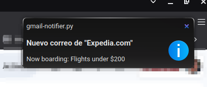
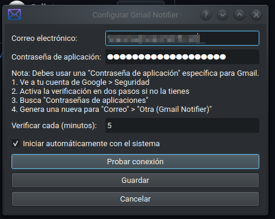
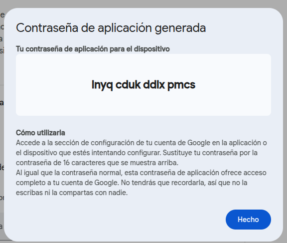

# Gmail Notifier para KDE

<div align="center">
  
  <br><br>
  <p>
    
    
    
    
  </p>
</div>

## 📋 Descripción

**Gmail Notifier** es una herramienta liviana para monitorear cuentas de correo de Google Workspace sin necesidad de tener un cliente de correo abierto. Funciona en segundo plano para mostrar notificaciones en la bandeja del sistema de KDE cuando llegan nuevos correos.

<div align="center">
  <p style="font-style: italic;">Mantente al día con tus correos importantes sin interrumpir tu flujo de trabajo.</p>
</div>

## ✨ Características principales

- 🔔 **Notificaciones nativas** en la bandeja del sistema de KDE
- 🚀 **Ligero y eficiente**: usa mínimos recursos del sistema
- 🔐 **Autenticación segura** mediante contraseñas de aplicación
- 🔄 **Verificación periódica** de nuevos correos
- 📱 **Acceso rápido** a Gmail con un solo clic
- 🔧 **Integración perfecta** con el entorno KDE
- 🔒 **Seguro**: almacena las contraseñas de forma encriptada

## 🖥️ Capturas de pantalla

<div align="center">
  <table>
    <tr>
      <td align="center"><strong>Notificación en la bandeja del sistema</strong></td>
      <td align="center"><strong>Configuración de la cuenta</strong></td>
    </tr>
    <tr>
      <td></td>
      <td></td>
    </tr>
  </table>
</div>

## 🔧 Requisitos

- **Arch Linux** (o distribución basada en Arch)
- **KDE Plasma** 5.x o superior
- **Python** 3.6 o superior
- **pip** y **virtualenv**
- **PyQt5**
- Cuenta de **Google Workspace** o **Gmail**
- **Verificación en dos pasos** habilitada en tu cuenta de Google

## 📦 Instalación

### 1. Clonar el repositorio

```bash
git clone https://github.com/panxos/gmail-notifier.git
cd gmail-notifier
```

### 2. Ejecutar el instalador

```bash
chmod +x installer-script.sh
./installer-script.sh
```

El instalador:
1. Verificará e instalará las dependencias necesarias
2. Creará un entorno virtual para las bibliotecas Python requeridas
3. Configurará el inicio automático con tu sesión de KDE
4. Instalará el script y los archivos de configuración

### 3. Crear una contraseña de aplicación para Gmail

Para usar Gmail Notifier, necesitas crear una contraseña de aplicación específica:

1. Ve a la [configuración de seguridad de tu cuenta de Google](https://myaccount.google.com/security)
2. Asegúrate de tener activada la "Verificación en dos pasos" ([ver instrucciones](https://support.google.com/mail/answer/185833?hl=es-419))
3. Busca "Contraseñas de aplicaciones" y haz clic en ella
4. Selecciona "Correo" como aplicación y "Otra (nombre personalizado)" como dispositivo
5. Escribe "Gmail Notifier" como nombre y haz clic en "Generar"
6. Google mostrará una contraseña de 16 caracteres - cópiala (la necesitarás para configurar Gmail Notifier)

<div align="center">
  
</div>

### 4. Configurar Gmail Notifier

Al iniciar Gmail Notifier por primera vez, se abrirá automáticamente la ventana de configuración:

1. Introduce tu dirección de correo electrónico de Gmail
2. Pega la contraseña de aplicación que generaste anteriormente
3. Ajusta el intervalo de comprobación si lo deseas (por defecto: 5 minutos)
4. Haz clic en "Probar conexión" para verificar que todo funciona correctamente
5. Guarda la configuración

Gmail Notifier comenzará a funcionar inmediatamente y aparecerá un icono en la bandeja del sistema.

## 🚀 Uso

- **Clic izquierdo** en el icono: Abre Gmail en tu navegador predeterminado
- **Clic derecho** en el icono: Muestra un menú con opciones
  - **Abrir Gmail**: Abre Gmail en tu navegador
  - **Verificar ahora**: Fuerza una verificación inmediata de nuevos correos
  - **Configuración**: Abre el diálogo de configuración
  - **Salir**: Cierra la aplicación

## ⚙️ Configuración personalizada

Puedes reconfigurar Gmail Notifier en cualquier momento haciendo clic derecho en el icono de la bandeja del sistema y seleccionando "Configuración".

Desde el diálogo de configuración puedes:
- Cambiar la cuenta de Gmail
- Actualizar la contraseña de aplicación
- Modificar el intervalo de verificación
- Activar/desactivar el inicio automático

## 🗑️ Desinstalación

Si deseas desinstalar Gmail Notifier, ejecuta:

```bash
./installer-script.sh --remove
```

Esto eliminará todos los archivos y configuraciones relacionados con Gmail Notifier.

## 🔍 Solución de problemas

### No recibo notificaciones de nuevos correos
- Verifica que la conexión se ha establecido correctamente en la configuración
- Asegúrate de que la contraseña de aplicación es correcta
- Comprueba que no tienes filtros en Gmail que marquen automáticamente los correos como leídos

### Error de autenticación
- Asegúrate de estar usando una contraseña de aplicación, no tu contraseña principal de Google
- Verifica que has habilitado correctamente la verificación en dos pasos
- Genera una nueva contraseña de aplicación e intenta nuevamente

### El icono no aparece en la bandeja del sistema
- Verifica que tu panel de KDE tenga habilitado el applet de bandeja del sistema
- Ejecuta `gmail-notifier` desde la terminal para ver posibles errores

### Error "externally-managed-environment"
- El instalador crea un entorno virtual para evitar este problema
- Si persiste, elimina el entorno y vuelve a ejecutar el instalador

## 🛠️ Desarrollo

### Estructura del proyecto
```
gmail-notifier/
├── gmail-notifier.py    # Script principal
├── installer-script.sh  # Instalador/desinstalador
├── README.md            # Documentación
└── screenshots/         # Capturas de pantalla para la documentación
```

## 📄 Licencia

Este proyecto está bajo la licencia Creative Commons Attribution 4.0 International (CC BY 4.0).

<a rel="license" href="http://creativecommons.org/licenses/by/4.0/">
  
</a>

## 👨‍💻 Autor

**P4NX0S** - [GitHub](https://github.com/panxos)

---

<div align="center">
  <p>
    <sub>Desarrollado con ❤️ para la comunidad de KDE y Arch Linux</sub>
  </p>
  <p>
    <sub>© 2025 - P4NX0S - CHILE</sub>
  </p>
</div>
